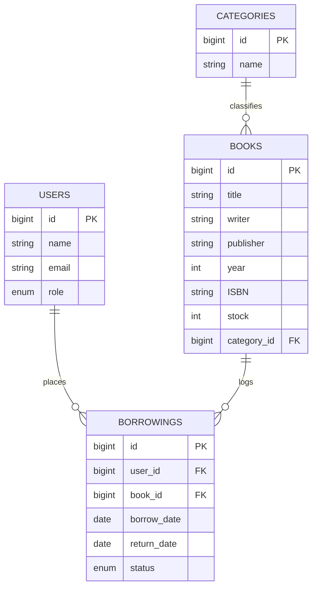

# 📊 System Architecture & Backend Blueprint

This guide details the core architectural layers, database patterns, Role-Based Access Controls (RBAC), and inventory protection mechanisms utilized in the BookSpace system.

---

## 🔑 Role-Based Access Control (RBAC)

BookSpace implements a lightweight, secure, role-based boundary system utilizing a single enum column in the database users schema, guarded via variadic route middleware filters.

### 1. Database User Schema
The `users` table contains a structured enum column defining exactly three system roles:
```php
Schema::create('users', function (Blueprint $table) {
    $table->id();
    $table->string('name');
    $table->string('email')->unique();
    $table->timestamp('email_verified_at')->nullable();
    $table->string('password');
    $table->enum('role', ['admin', 'petugas', 'peminjam'])->default('peminjam');
    $table->rememberToken();
    $table->timestamps();
});
```

### 2. Variadic Middleware (`RoleMiddleware`)
Rather than creating separate middleware files for each access level, BookSpace uses a dynamic, variadic middleware filter located in [RoleMiddleware.php](file:///c:/laragon/www/BookSpace/app/Http/Middleware/RoleMiddleware.php). It parses parameter lists using variadic parameters `...$roles`:

```php
namespace App\Http\Middleware;

use Closure;
use Illuminate\Http\Request;
use Symfony\Component\HttpFoundation\Response;

class RoleMiddleware
{
    public function handle(Request $request, Closure $next, ...$roles): Response
    {
        if (!auth()->check()) {
            return redirect('login');
        }

        if (in_array(auth()->user()->role, $roles)) {
            return $next($request);
        }

        abort(403, 'Unauthorized action.');
    }
}
```

### 3. Middleware Registration (Laravel 11)
In **Laravel 11**, route middleware classes are bound directly inside [bootstrap/app.php](file:///c:/laragon/www/BookSpace/bootstrap/app.php) using the modern configuration builder:

```php
use App\Http\Middleware\RoleMiddleware;

return Application::configure(basePath: dirname(__DIR__))
    ->withRouting(
        web: __DIR__.'/../routes/web.php',
        commands: __DIR__.'/../routes/console.php',
        health: '/up',
    )
    ->withMiddleware(function (Middleware $middleware) {
        $middleware->alias([
            'role' => RoleMiddleware::class,
        ]);
    })
    ->withExceptions(function (Exceptions $exceptions) {
        //
    })->create();
```

---

## 🗄️ Database Schema & Eloquent Relationships

BookSpace manages library assets and circulations using a highly relational layout:



### Eloquent Relationships Matrix

- **User Model**:
  - `hasMany(Borrowing::class)`: Represents the list of borrowings placed by a borrower user.
- **Category Model**:
  - `hasMany(Book::class)`: Classifies library books.
- **Book Model**:
  - `belongsTo(Category::class)`: Identifies the asset classification.
  - `hasMany(Borrowing::class)`: Tracks historical and active borrows.
- **Borrowing Model**:
  - `belongsTo(User::class)`: Resolves the active borrower.
  - `belongsTo(Book::class)`: Resolves the checked-out book item.

---

## 🛡️ Concurrency & Stock Protection Integrity

When checking out books, concurrent transactions can cause race conditions (e.g., two users borrow the last remaining stock of a book simultaneously). BookSpace prevents this by wrapping the transaction block inside a database-level pessimistic row lock using `lockForUpdate()`.

### Checkout Transaction Flow
Located within [BorrowingController.php](file:///c:/laragon/www/BookSpace/app/Http/Controllers/BorrowingController.php), the checkout logic locks the target book row before modifying counts:

```php
use Illuminate\Support\Facades\DB;
use App\Models\Book;
use App\Models\Borrowing;

DB::beginTransaction();
try {
    // Acquire a pessimistic row-level lock on the target book record
    $book = Book::lockForUpdate()->findOrFail($request->book_id);

    // Prevent checkout if stock is depleted
    if ($book->stock <= 0) {
        return redirect()->back()
            ->withInput()
            ->with('error', __('This book is currently out of stock!'));
    }

    // Automate stock reduction
    $book->decrement('stock');

    // Create the circulation log
    Borrowing::create([
        'user_id' => $request->user_id,
        'book_id' => $request->book_id,
        'borrow_date' => $request->borrow_date,
        'return_date' => $request->return_date ?? date('Y-m-d', strtotime('+7 days')),
        'status' => 'borrowed',
    ]);

    DB::commit();
} catch (\Exception $e) {
    DB::rollBack();
    return redirect()->back()->with('error', __('An error occurred while processing the borrowing transaction.'));
}
```

### Return Transaction Flow
When a book is returned, BookSpace updates the circulation status and automatically increments stock by 1:

```php
DB::beginTransaction();
try {
    $borrowing = Borrowing::findOrFail($id);

    if ($borrowing->status === 'returned') {
        return redirect()->back()->with('error', __('This book has already been returned.'));
    }

    $borrowing->update(['status' => 'returned']);
    $borrowing->book()->increment('stock');

    DB::commit();
} catch (\Exception $e) {
    DB::rollBack();
    return redirect()->back()->with('error', __('An error occurred while processing the return transaction.'));
}
```
