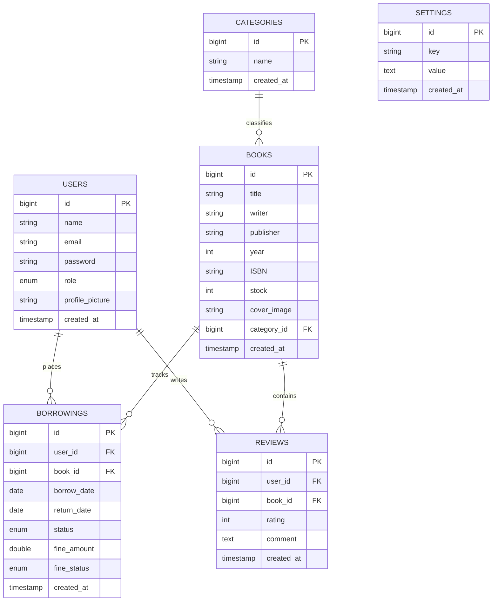

# 📊 System Architecture & Backend Blueprint

This engineering guide details the core architectural layers, database design, Role-Based Access Controls (RBAC), concurrency safeguards, and performance optimization techniques that power the **BookSpace** backend.

---

## 🔑 Role-Based Access Control (RBAC) & Middleware

BookSpace implements a lightweight, secure role boundary utilizing a single enum column in the database users schema, guarded via variadic route middleware filters.

### 1. Database User Schema
The `users` table contains a structured `enum` column defining exactly three system roles:
```php
Schema::create('users', function (Blueprint $table) {
    $table->id();
    $table->string('name');
    $table->string('email')->unique();
    $table->timestamp('email_verified_at')->nullable();
    $table->string('password');
    $table->enum('role', ['admin', 'petugas', 'peminjam'])->default('peminjam');
    $table->string('profile_picture')->nullable();
    $table->rememberToken();
    $table->timestamps();
});
```

### 2. Variadic Middleware (`RoleMiddleware.php`)
Rather than creating separate middleware classes for each access level, BookSpace uses a dynamic, variadic middleware filter located at [RoleMiddleware.php](file:///c:/laragon/www/BookSpace/app/Http/Middleware/RoleMiddleware.php). It parses parameter lists using variadic parameters `...$roles` to allow multiple authorized roles to pass through a single route group:

```php
namespace App\Http\Middleware;

use Closure;
use Illuminate\Http\Request;
use Symfony\Component\HttpFoundation\Response;

class RoleMiddleware
{
    /**
     * Handle an incoming request.
     *
     * @param  Closure(Request): (Response)  $next
     */
    public function handle(Request $request, Closure $next, ...$roles): Response
    {
        if (!auth()->check() || !in_array(auth()->user()->role, $roles)) {
            abort(403, 'Unauthorized access.');
        }

        return $next($request);
    }
}
```

### 3. Middleware Registration (Laravel 11)
In **Laravel 11**, route middleware classes are bound directly inside [bootstrap/app.php](file:///c:/laragon/www/BookSpace/bootstrap/app.php) using the modern configuration builder:

```php
$middleware->alias([
    'role' => \App\Http\Middleware\RoleMiddleware::class,
]);
```
This enables expressive route declarations in [routes/web.php](file:///c:/laragon/www/BookSpace/routes/web.php):
```php
// Borrower (Peminjam) scoped routes
Route::middleware(['auth', 'role:peminjam'])->group(function () {
    Route::get('/catalog', [BorrowerCatalogController::class, 'catalog'])->name('peminjam.catalog');
    Route::post('/reserve', [BorrowerCatalogController::class, 'reserveBook'])->name('peminjam.reserve');
});

// Staff & Admin joint scoped routes
Route::middleware(['auth', 'role:admin,petugas'])->group(function () {
    Route::resource('books', BookController::class);
    Route::resource('categories', CategoryController::class);
    Route::post('/borrowings/{borrowing}/return', [BorrowingController::class, 'returnBook'])->name('borrowings.return');
});
```

---

## ⚡ Thin Controllers & Validation Form Requests

To keep controllers concise and focused purely on orchestrating transactions, all HTTP request validations, authorization checks, and custom error handling are refactored into dedicated Form Request classes under `app/Http/Requests/`.

### 1. Cover Image Validation (`StoreBookRequest.php`)
Managed inside [StoreBookRequest.php](file:///c:/laragon/www/BookSpace/app/Http/Requests/StoreBookRequest.php), the request enforces exact bounds, including custom error messages and file constraints (e.g. limiting cover uploads to exactly 2MB):

```php
public function rules(): array
{
    return [
        'title' => 'required|string|max:255',
        'writer' => 'required|string|max:255',
        'publisher' => 'required|string|max:255',
        'year' => 'required|integer|min:1000|max:' . date('Y'),
        'ISBN' => 'required|string|max:50',
        'stock' => 'required|integer|min:0',
        'category_id' => 'required|exists:categories,id',
        'cover_image' => 'nullable|image|mimes:jpeg,png,jpg,gif|max:2048', // Max 2MB file
    ];
}
```

### 2. Validator Post-Processor Hook (`StoreReviewRequest.php`)
BookSpace implements a strict rule: *a borrower can only write a review for a book they have successfully borrowed and returned*. Inside [StoreReviewRequest.php](file:///c:/laragon/www/BookSpace/app/Http/Requests/StoreReviewRequest.php), this constraint is verified dynamically using the validator lifecycle `after()` hook:

```php
public function after(): array
{
    return [
        function ($validator) {
            $userId = auth()->user()->id;
            $bookId = $this->input('book_id');

            // Confirm a 'returned' borrowing record exists for this user and book
            $hasReturned = \App\Models\Borrowing::where('user_id', $userId)
                ->where('book_id', $bookId)
                ->where('status', 'returned')
                ->exists();

            if (!$hasReturned) {
                $validator->errors()->add('book_id', __('You can only review books you have borrowed and returned.'));
            }
        }
    ];
}
```

---

## 🛡️ Atomic Concurrency & Stock Protection Integrity

When checking out books, concurrent transactions can cause race conditions (e.g., two users attempt to borrow the last remaining copy of a book simultaneously). BookSpace prevents this by wrapping the checkouts inside a database transaction (`DB::transaction`) and applying a pessimistic row-level lock via Eloquent's `lockForUpdate()`.

### 1. Pessimistic Locking during Reservation Checkout
Located inside [BorrowerCatalogController.php](file:///c:/laragon/www/BookSpace/app/Http/Controllers/BorrowerCatalogController.php#L47-L99), the reservation transaction prevents over-borrowing by locking the `books` row before inspecting stock or decrementing:

```php
DB::transaction(function () use ($book, $userId, $durationDays) {
    // Re-acquire and lock the specific book record for update
    $lockedBook = Book::lockForUpdate()->find($book->id);

    if ($lockedBook->stock <= 0) {
        throw new \Exception("Out of stock");
    }

    // Record the circulation entry
    Borrowing::create([
        'user_id' => $userId,
        'book_id' => $lockedBook->id,
        'borrow_date' => now(),
        'return_date' => now()->addDays($durationDays),
        'status' => 'borrowed',
    ]);

    // Atomic decrement
    $lockedBook->decrement('stock');
});
```

### 2. Circulation Return Stock Recovers
When a book is returned, BookSpace updates the borrowing status and automatically increments stock by 1 within a secure `DB::beginTransaction()` block inside [BorrowingController.php](file:///c:/laragon/www/BookSpace/app/Http/Controllers/BorrowingController.php#L63-L86):

```php
try {
    DB::beginTransaction();

    $borrowing->update([
        'status' => 'returned',
        'return_date' => date('Y-m-d'), // Set actual return date
    ]);

    // Stock increment
    $borrowing->book->increment('stock');

    DB::commit();
} catch (\Exception $e) {
    DB::rollBack();
    return redirect()->back()->with('error', __('An error occurred while processing the return transaction.'));
}
```

---

## ⚡ Performance Optimization

BookSpace enforces top-tier performance standards to prevent latency and heavy database loads on local SQLite configurations.

### 1. Eliminating N+1 Query Overhead
Without optimization, rendering a list of books along with their associated category and reviewer profiles would cause a separate query for each record (N+1 query problem). BookSpace eliminates this by implementing explicit Eloquent **Eager Loading** (`with([...])`) across resources:

*   **Book Catalog Listing** ([BorrowerCatalogController.php](file:///c:/laragon/www/BookSpace/app/Http/Controllers/BorrowerCatalogController.php#L22)):
    ```php
    Book::with(['category', 'reviews.user'])
    ```
*   **Borrowings Index** ([BorrowingController.php](file:///c:/laragon/www/BookSpace/app/Http/Controllers/BorrowingController.php#L16)):
    ```php
    Borrowing::with(['user', 'book'])
    ```

### 2. Database-Level Aggregates
Rather than pulling full collections into memory and counting them in PHP, dashboard indicators leverage direct SQLite aggregate counts, reducing memory footprints:
```php
// Under DashboardController
$booksCount = Book::count();
$borrowedCount = Borrowing::where('status', 'borrowed')->count();
$lateCount = Borrowing::where('status', 'borrowed')->where('return_date', '<', date('Y-m-d'))->count();
```

---

## 🗄️ Database Schema & Eloquent Relationships

BookSpace is built on a highly relational schema structured to guarantee referential integrity:



### Relationship Abstractions

1.  **User Model** ([User.php](file:///c:/laragon/www/BookSpace/app/Models/User.php)):
    - `hasMany(Borrowing::class)`: Resolves list of active/completed borrowings.
    - `hasMany(Review::class)`: Resolves reviews composed by the user.
    - `belongsToMany(Book::class, 'wishlists')`: Maps wishlisted books via a clean pivot table.
2.  **Book Model** ([Book.php](file:///c:/laragon/www/BookSpace/app/Models/Book.php)):
    - `belongsTo(Category::class)`: Resolves category taxonomy.
    - `hasMany(Borrowing::class)`: Tracks historical circulation checkouts.
    - `hasMany(Review::class)`: Resolves community reviews.
3.  **Borrowing Model** ([Borrowing.php](file:///c:/laragon/www/BookSpace/app/Models/Borrowing.php)):
    - `belongsTo(User::class)`: Identifies the active borrower.
    - `belongsTo(Book::class)`: Identifies the checked-out literary asset.
4.  **Setting Model** ([Setting.php](file:///c:/laragon/www/BookSpace/app/Models/Setting.php)):
    - Key-value key registries (`max_books_allowed`, `default_borrow_duration`, `daily_fine_rate`) handled dynamically via custom `get($key, $default)` and `set($key, $value)` static wrappers.
