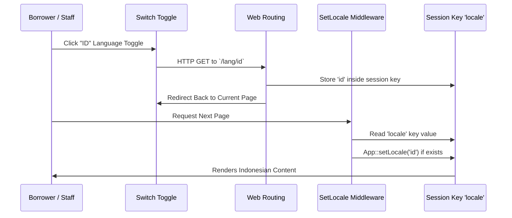

# 🌐 Multi-Language System & Localization Guide

This guide explains how BookSpace's multi-language framework handles real-time locale switching between English (EN) and Indonesian (ID).

---

## ⚙️ Locale Switching Architecture

BookSpace handles dynamic switching using a lightweight, session-based middleware pattern, which avoids complex URL route prefixes like `/en/dashboard` or `/id/dashboard`.



---

## 🛠️ Routing & Middleware Configuration

### 1. Locale Switch Route
The route `/lang/{locale}` is defined in [routes/web.php](file:///c:/laragon/www/BookSpace/routes/web.php). It accepts a two-character locale code, validates it, saves it in the session, and redirects back:

```php
Route::get('/lang/{locale}', function (string $locale) {
    if (in_array($locale, ['en', 'id'])) {
        session()->put('locale', $locale);
    }
    return back();
})->name('locale.switch');
```

### 2. Localization Middleware (`SetLocale`)
The dynamic localizer middleware checks for the session key on every incoming HTTP request. Create a middleware class at `app/Http/Middleware/SetLocale.php` or bind it directly in the kernel:

```php
namespace App\Http\Middleware;

use Closure;
use Illuminate\Http\Request;
use Illuminate\Support\Facades\App;
use Symfony\Component\HttpFoundation\Response;

class SetLocale
{
    public function handle(Request $request, Closure $next): Response
    {
        if (session()->has('locale')) {
            App::setLocale(session()->get('locale'));
        }
        
        return $next($request);
    }
}
```

Registered inside `bootstrap/app.php` to run globally:
```php
$middleware->web(append: [
    \App\Http\Middleware\SetLocale::class,
]);
```

---

## 🗄️ Translation Matrices (JSON Dictionary)

Translations are maintained inside flat key-value JSON files inside the `lang/` folder:
- **English Dictionary**: [lang/en.json](file:///c:/laragon/www/BookSpace/lang/en.json)
- **Indonesian Dictionary**: [lang/id.json](file:///c:/laragon/www/BookSpace/lang/id.json)

### Adding New Translation Keys
To translate a phrase, add the translation string key-value pair to both files:

**English Dictionary (`en.json`)**:
```json
{
    "Welcome back to BookSpace": "Welcome back to BookSpace",
    "Nearest Return Deadline": "Nearest Return Deadline"
}
```

**Indonesian Dictionary (`id.json`)**:
```json
{
    "Welcome back to BookSpace": "Selamat datang kembali di BookSpace",
    "Nearest Return Deadline": "Tenggat Waktu Terdekat"
}
```

---

## 📝 Blade Translation Standards

BookSpace enforces a strict zero-hardcoded-text rule. All user-facing strings must utilize translation helpers:

### 1. Simple Helper Standard (`__('...')`)
Use the `__` function for inline strings, including buttons, headings, table cells, and list labels:
```html
<h2 class="text-2xl font-bold">{{ __('Book Catalog') }}</h2>
<button type="submit" class="btn-primary">{{ __('Save') }}</button>
```

### 2. Input Placeholders & Select Options
You can also use helper keys in select inputs and text placeholders:
```html
<input type="text" placeholder="{{ __('Search book title or writer...') }}">

<option value="">{{ __('Select Category') }}</option>
```

### 3. Dynamic Values Standard (`:parameter`)
To inject dynamic variables (like names, counts, or dates) into translations, use key parameters:
```html
{{ __('Welcome back, :name!', ['name' => auth()->user()->name]) }}
```
**In `en.json`**: `"Welcome back, :name!": "Welcome back, :name!"`  
**In `id.json`**: `"Welcome back, :name!": "Selamat datang kembali, :name!"`

### 4. Component Block Directive (`@lang`)
For block-level texts where clean Blade escaping is needed:
```html
<p class="text-sm">
    @lang('Here is an overview of your library activity today.')
</p>
```
